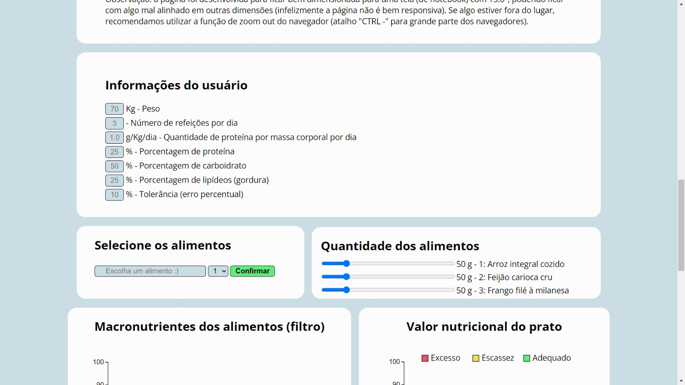
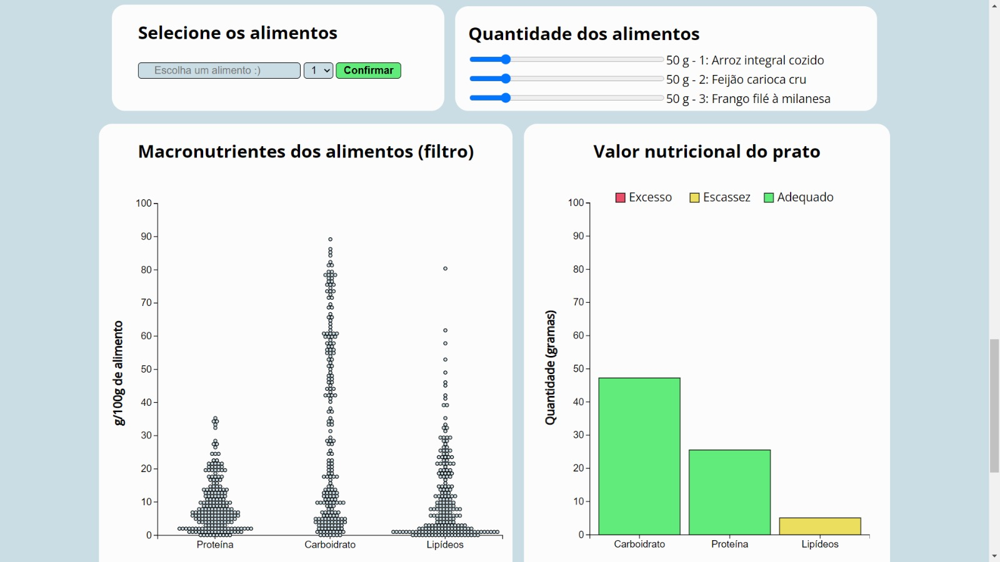

## Tarefa 3: Visualização interativa

Trabalho elaborado pelos alunos Bruno Fornaro Pereira [Bruno Fornaro Pereira](https://github.com/BrunoFornaro) e [Vanessa Berwanger Wille](https://github.com/VanessaWille) para a disciplina de Visualização de Dados, com o objetivo de criar uma visualização interativa com a biblioteca D3.js. 

## Nutrição em um Olhar

O tema escolhido para esse trabalho está relacionado à área de nutrição, onde procuramos, a partir de uma visualização interativa, possibilitar ao usuário um maior entendimento sobre os alimentos (macronutrientes) e compreender se suas escolhas alimentares estão balanceadas: "O conhecimento da composição dos alimentos consumidos no Brasil é fundamental para se alcançar a segurança alimentar e nutricional. As informações de composição de alimentos são pilares básicos para a educação nutricional e a avaliação da ingestão de nutrientes de indivíduos." (Tabela Brasileira de Composição de Alimentos – TACO, 4ª edição revisada e ampliada). 

Nesse sentido, a principal pergunta que nos interessa responder é quais alimentos (e combinações) e em quais quantidades fornecem uma alimentação adequada em macronutrientes? 

 Os dados necessários foram obtidos através do Kaggle, sendo o dataset escolhido: [Composição nutricional de alimentos - TACO](https://www.kaggle.com/datasets/ispangler/composio-nutricional-de-alimentos-taco). Nele temos dados sobre a composição dos principais alimentos consumidos no Brasil, baseado em um plano de amostragem que garante valores representativos, com análises realizadas por laboratórios com capacidade analítica comprovada. 

### Decisões de design

Inicialmente procuramos entender os dados e o que seria mais interessante a ser apresentado. Como a base principal de nossa alimentação é composta por carboidratos, proteínas e gorduras (macronutrientes), optamos por trabalhar em cima desses valores. 

A ideia central era permitir ao usuário uma experiência na qual ele pudesse, além de filtrar os alimentos por quantidade de macronutrientes, conseguisse, de modo geral, ter alguma informação sobre o quão adequada é a sua refeição.

Para isso, iniciamos desenvolvendo alguns filtros que permitem ao usuário selecionar os alimentos que ele deseja visualizar: podem ser escolhidos até 3 alimentos, indicar as quantidades que serão consumidas e, a partir disso, o sistema calcula a quantidade de macronutrientes que serão ingeridos. A seleção dos alimentos é feita através de um dropdown, que, inicialmente, contém todos os alimentos presentes no dataset. Contudo, como são muitos, apenas esse tipo de solução seria ineficiente. Assim, adicionamos a opção de escrever o nome do alimento que se deseja buscar, e o sistema filtra os alimentos que contém o texto digitado. 

Também adicionamos na visualização um violin plot (primordialmente, a ideia era um box plot, contudo, algumas críticas indicaram que ele poderia ser difícil de interpretar e, nesse caso, realmente concordamos que um violin plot seria mais compreensível, além de podermos adicionar um tooltip para cada elemento e ver sua posição, isso é, a quantidade de macronutriente presente), útil para entender a distribuição dos dados e, a partir dela, poder selecionar os alimentos que gostaria de ter em sua refeição (por exemplo, alimentos com mais proteína, menos gordura, etc). Portanto, no violin plot adicionamos a funcionalidade de selecionar os pontos a partir de um brush (nos inspiramos no notebook ["Brushable Parallel Coordinates"](https://observablehq.com/@d3/brushable-parallel-coordinates), contudo criamos nosso código do zero), e, diante disso, o dropdown é atualizado com os alimentos que pertencem ao intervalo escolhido. Quando fazemos o filtro, o violin plot é atualizado para possuir apenas os pontos que correspondem ao filtro, mas ainda é plotado um segundo violin plot por trás com uma visão geral, com os valores antes do filtro. O violin plot principal é feito com círculos e foi adicionada uma tooltip para ver qual alimento é cada ponto, porém o segundo gráfico que fica por trás fica sombreado e os pontos são trocados por retângulos, para não passar a impressão ao usuário de que os pontos após o filtro estão na mesma posição de antes (isso não é verdade pois recentralizamos os pontos no violin plot). 

Por conta da escolha do uso do violin plot, precisamos filtrar um pouco mais os nossos dados e reduzir a um número viável de dados, pois existia uma quantidade elevada de dados numa mesma faixa de valor nutricional. Nesse sentido, removemos os dados que possuíam algum valor de macro nutriente faltante (isso já seria feito de toda forma, pois não queremos incluir em nossas refeições alimentos com as informações nutricionais desconhecidas, se pretendemos montar um prato equilibrado) e também removemos dados que tivessem apenas 0,5 gramas ou menos de lipídeos por 100 gramas do alimento. Essa decisão não foi tão problemática pois o objetivo do projeto é explorar as ferramentas de interatividade nas visualizações.

Com isso, conseguimos realizar os filtros desejados e selecionar cada alimento, de forma que também deve ser indicado qual sua numeração (1, 2 ou 3) no prato, o que também é feito a partir de um dropdown. Assim, podemos adicioná-lo à lista de alimentos que serão consumidos a partir do botão "Confirmar".

Ainda, a quantidade de macronutrientes que serão ingeridos é calculada a partir das porções que o usuário deseja consumir dos alimentos escolhidos. Essas porções são indicadas através de um slider. Com esses dados preenchidos, é possível mostrar ao usuário, a partir de um gráfico de barras, o total de cada macronutriente em sua escolha.

Como desejava-se que o usuário pudesse ter uma noção geral sobre a qualidade de sua refeição, adicionamos mais algumas opções de preenchimento, onde são escolhidas as proporções desejadas de macronutrientes (por padrão estão definidas como 25% para gorduras, 25% para proteínas e 50% para carboidratos, recomendações da nutricionista Isolda Vasconcelos em [Saúde e Nutrição](https://www.boasaude.com.br/nutricao/15404/qual-a-proporcao-de-proteina-e-carboidratos-ideal-nas-refeicoes.html)), indicação do peso corporal, quantidade de refeições por dia (por padrão definida como 3) e a quantidade de proteína por massa corporal que você ingerir por dia (por padrão definida como 1.0). A partir desses elementos, é possível calcular, de maneira geral, a quantidade de cada macronutriente que deve ser ingerida por refeição, e, a partir disso, indicar, pelas cores do gráfico, se a refeição está balanceada ou 

### Uma visão geral do processo de desenvolvimento.

O processo de desenvolvimento foi feito em conjunto, onde cada um dos integrantes do grupo contribuiu com ideias e sugestões. A partir disso, foram feitos alguns esboços de como seria a visualização, e, então, a implementação. Iniciamos usando o "Live Share" do VSCode, porém, posteriormente, seguimos para Observable, onde foi possível trabalhar de forma mais eficiente e organizada.

De começo, passamos bastante tempo entendendo como eram as funcionalidades do D3.js, bem como implementar as interações/conexões, processos nos quais passamos a maior parte do tempo. Antes do MVP, foram cerca de 12 horas de trabalho por integrante. Após o MVP, foram cerca de mais 60 horas, sendo que na maior parte do tempo nos reunimos para poder discutir algumas ideias e dúvidas que surgiam.

### Imagens do funcionamento do site

### O que os dados nos revela
Pela natureza da interatividade da visualização, é evidente que os dados vão revelar resultados diferentes para cada usuário. Entretanto, no geral, podemos ver dois tipos de resultados interessantes que podem ser obtidos com a ferramenta implementada:
+ Conseguimos verificar de acordo com os nossos dados e as informações dos usuários, ao colocar alimentos e pesos que são da alimentação frequente do usuário, se ele costuma fazer refeições equilibradas,
+ Com a ferramenta conseguimos com certa facilidade montar diferentes pratos que correspondem a uma alimentação equilibrada (com relação aos macronutrientes), as vezes com alimentos não antes pensados para uma alimentação desse tipo, pois conseguimos equilibrar com a quantidade de cada alimento ingerido (por exemplo, ingerir alimentos com um valor nutricional não muito bom, mas em baixa quantidade, para ainda assim conseguir uma refeição adequada).

### Links importantes
* [Notebook observable](https://observablehq.com/d/ffb89fcb60d326fa)
* [Página do projeto final](https://fgv-vis-2023.github.io/assignment-3-nutricao_em_um_olhar/)
* [Links do MVP](https://fgv-vis-2023.github.io/assignment-3-nutricao_em_um_olhar/links_mvp.html)
